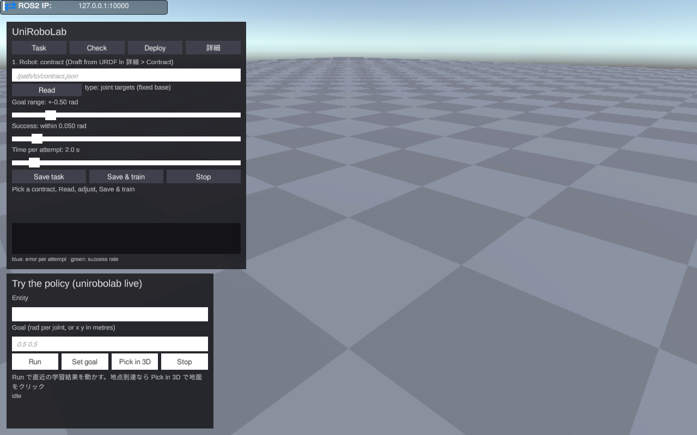
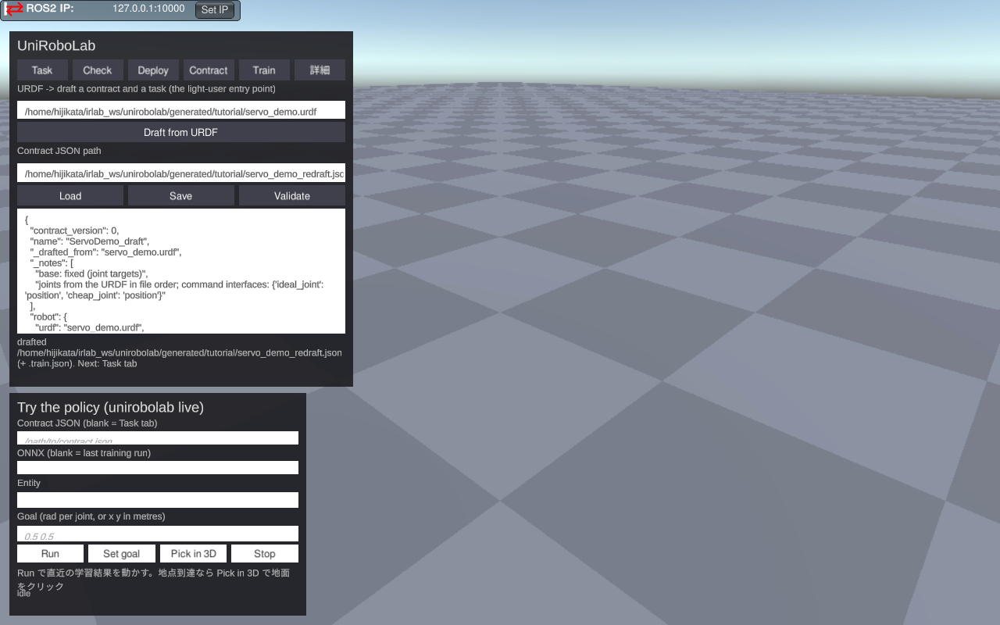
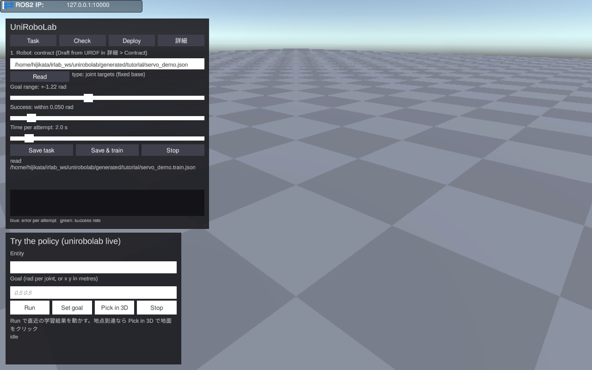
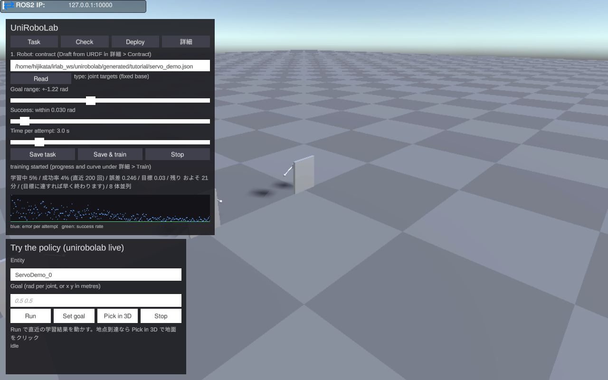
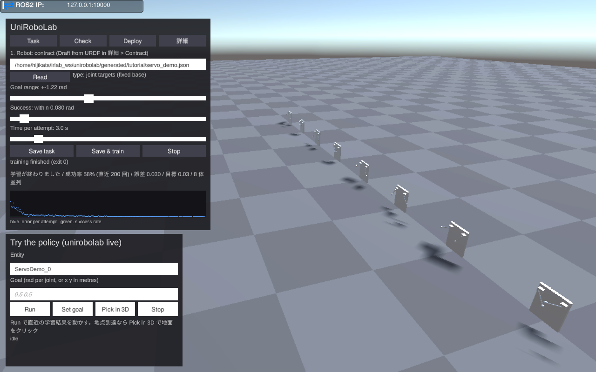
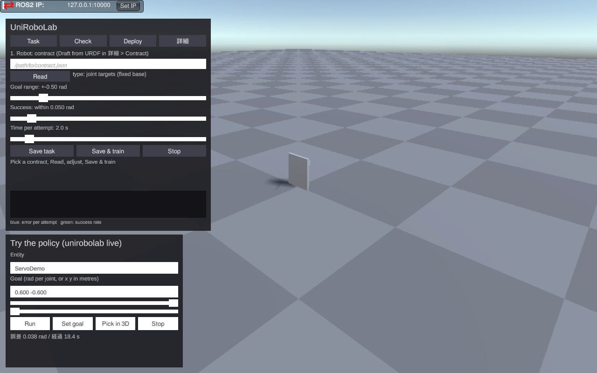
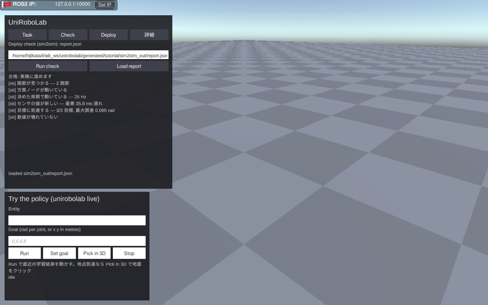
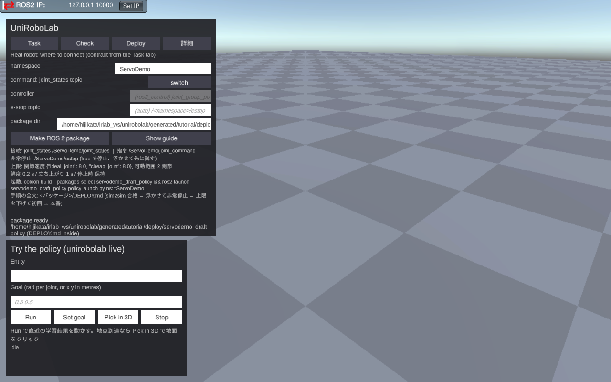

# チュートリアル: URDF から実機用パッケージまで (servo_demo)

> 注 (2026-09-16): この文書は v1 の GUI (Task / Check / Deploy タブ) で撮ったものです。GUI は docs/ux-flow.md v2.1 の
> ウィザード (① ロボット → ⑥ 実機へ) に作り直し中で、画面は docs/images/wizard/ にあります。手順書は作り直し後に差し替えます。

UniRoboLab の GUI だけで、ロボットの URDF から「学習 → 試す → 配備前チェック → 実機向けの ROS 2 パッケージ」
まで通す手順です。題材は 2 関節のサーボ台 (servo_demo)。関節を目標角へ動かす方策を学習します。
所要時間はおよそ 30 分 (うち学習が 10〜15 分)。

このチュートリアルの画面は 2026-09-16 に実際に通したときのものです。

## 0. 準備

必要なもの:

- UniRoboLab のプレイヤー (`scripts/build_player.sh` で `generated/player/UniRoboLab.x86_64` を作る)
- Python 環境 (`scripts/setup_python.sh --training`。`.venv/bin/python` ができる)
- 配備前チェック (sim2sim) だけ ROS 2 が要る。ここでは同梱の Docker コンテナ
  (`scripts/sim2sim_container.sh start`) を使う
- ロボットの URDF。ここでは `generated/tutorial/servo_demo.urdf` にコピーしておく

設定ファイル (`scripts/tutorial_resources.json`) を用意し、プレイヤーに渡します。

```json
{
  "settings": { "physics_hz": 50, "target_fps": 120, "time_scale": 10,
                "stepping_steps_per_frame": 8, "learning_port": 10111 },
  "unirobolab": { "python": "<リポジトリ>/.venv/bin/python",
                  "policy_runner_env": "PYTHONPATH=<リポジトリ>/python/src" }
}
```

- `settings` はシミュレータ核の設定。`learning_port` が学習と「試す」の入口で、これが無いと
  GUI の学習ボタンは動きません。`time_scale` と `stepping_steps_per_frame` は学習を速くする設定です。
- `unirobolab` は GUI が呼ぶ Python の場所です。

起動:

```bash
SIMULATION_RESOURCES_CONFIG=$PWD/scripts/tutorial_resources.json generated/player/UniRoboLab.x86_64
```



左上が UniRoboLab パネルです。既定では **Task / Check / Deploy** の 3 つのタブと「詳細」ボタンだけが
見えます。「詳細」を押すと専門家向けのタブ (Contract / Train) が現れます。左下の
「Try the policy」は学習した方策をその場で動かすパネルです。

## 1. URDF から契約の草案を作る (詳細 > Contract)

「契約 (contract)」は、方策が何を見て何を出すか (関節の順番、観測、行動、周期、ROS のトピック) を
書いた JSON です。手で書く必要はなく、URDF から草案を作れます。

1. 「詳細」を押し、Contract タブを開く
2. 一番上の欄に URDF のパスを入れ、**Draft from URDF** を押す



契約 (`servo_demo.json`) と学習設定 (`servo_demo.train.json`) が URDF の隣にでき、エディタに契約が
表示されます。可動関節 (`ideal_joint`, `cheap_joint`) と、固定基体なので「関節目標」のタスクが
選ばれたことが `_notes` に書かれています。このとき Task タブの契約欄にもパスが入るので、
中身を読まなくても次へ進めます。

## 2. タスクを決めて学習する (Task)

Task タブに戻ると、草案の内容がスライダに反映されています (**Read** を押すと読み直せます)。



- **Goal range**: 目標角の範囲。URDF の可動範囲から ±1.22 rad が入っている
- **Success**: 成功とみなす誤差 (rad)
- **Time per attempt**: 1 回の試行の制限時間 (秒)

ここでは Success を 0.03 rad、Time per attempt を 3 秒にして **Save & train** を押します。
学習設定ファイルが書き換わり、8 体のロボットが並んで学習が始まります。



学習中は 1 秒ごとに進捗が文で出ます: 「学習中 5% / 成功率 4% (直近 200 回) / 誤差 0.246 / 目標 0.03 /
残り およそ 21 分 / (目標に達すれば早く終わります) / 8 体並列」。下の曲線は青が試行ごとの誤差、
緑が成功率です。残り時間は設定上限までの見込みで、目標の誤差に達すれば早く終わります。



この例では約 12 分、20 万ステップで目標 (誤差 0.030 rad) に達して止まりました。
「学習が終わりました / 成功率 58% (直近 200 回) / 誤差 0.030 / 目標 0.03」。
結果 (policy.onnx) は契約が指す `runs/ServoDemo_draft/` に置かれます。

うまく行かないとき (成功率が 0 のまま、途中で悪化する) は、この文の下に「次の一手」が出ます
(目標範囲を狭める、制限時間を延ばす、学習率を下げる)。

## 3. 試す (Try the policy)

学習した方策をその場で動かします。

1. 左下のパネルの **Run** を押す (契約と方策は Task タブと直近の学習結果が使われる)
2. 関節ごとにスライダが出るので動かす。目標が方策に送られ、ロボットが追従する



状態は「誤差 0.038 rad / 経過 18 s」のような文で出ます (目標 0.6, −0.6 rad)。台車のような地点到達のロボットでは
**Pick in 3D** を押して地面をクリックすると目標 (緑の円) を置け、走った軌跡が青い線で描かれます。

補足: 学習向けの `time_scale` が設定されていても、「試す」の間だけ実時間に戻ります。

## 4. 配備前チェック (Check)

実機に持っていく前に、ROS 2 の経路 (生成したノード ↔ シミュレータ) で方策を動かして、
関節が見つかるか、決めた周期で動くか、目標に到達するか、非常停止が効くかを確かめます。

チェックは ROS 2 が要るので、ここでは同梱のコンテナで実行します (GUI の **Run check** は、
設定の `unirobolab.sim2sim_command` にコンテナ内で `unirobolab sim2sim` を呼ぶコマンドを書くと
同じことをします)。

```bash
# コンテナ内 (scripts/sim2sim_container.sh shell)
unirobolab gen generated/tutorial/servo_demo.json --out generated/tutorial/pkg
colcon build --base-paths generated/tutorial/pkg ... && source install/setup.sh
N_ENTITIES=1 NS=ServoDemo bash scripts/servo_demo_bringup.sh
unirobolab sim2sim generated/tutorial/servo_demo.json --pkg servodemo_draft_policy --out generated/tutorial/sim2sim_out
```

できた `report.json` を Check タブの **Load report** で読むと、平易なチェックリストになります。
この例では合格でした: 関節が見つかる (2 関節)、25 Hz で動いている、センサの遅れは最悪 36 ms、
3 つの目標すべてに到達 (最大誤差 0.065 rad、許容 0.1 rad)。



NG があれば「次の一手」に何を直せばよいかが出ます (関節名の対応、行動の scale/offset、
許容誤差、シミュレータのフレームレート、など)。

## 5. 実機へ (Deploy)

Deploy タブで接続先を決めて **Make ROS 2 package** を押します。

- namespace: 実機のトピックの名前空間 (`/ServoDemo/joint_states` など)
- command: 指令の方式。`joint_states topic` (JointState を受けるドライバ) か
  `ros2_control controller` (`switch` で切替、コントローラ名を入れる)
- e-stop topic: 非常停止 (std_msgs/Bool)。空なら `/<namespace>/estop`
- package dir: 出力先。空なら契約の隣の `deploy/`



契約の ros 節が書き換わり、ROS 2 パッケージ (`servodemo_draft_policy`) が生成され、その中に
手順書 `DEPLOY.md` が置かれます。パネルには要約 (接続するトピック、非常停止、上限値、起動コマンド)
が出ます。実機では:

```bash
colcon build --packages-select servodemo_draft_policy && source install/setup.bash
ros2 launch servodemo_draft_policy policy.launch.py ns:=ServoDemo
```

DEPLOY.md の「動かす前に確かめること」(非常停止、可動範囲と速度の上限、観測の鮮度、
立ち上がり時間) を順に確認してから動かしてください。

## 困ったとき

| 症状 | 見るところ |
|---|---|
| 学習ボタンを押しても何も起きない | 設定の `settings.learning_port` が無い。パネルの状態行に理由が出る |
| 「試す」で誤差が大きいまま | 方策が学習結果と別のものを指していないか (「詳細」で契約と ONNX の欄を確認) |
| Check が NG | Check タブの「次の一手」。関節名違いは Contract タブで直す |
| 日本語が表示されない | OS に日本語フォント (Noto Sans CJK など) が無いと英語表示になる |

## このチュートリアルで気づいた点 (GUI 改善の候補)

通しで動かして直したもの (このチュートリアルの作成中に見つかった不具合):

- 学習向けの `time_scale` のまま「試す」と、実時間で動く実行器に対してシミュレータが 10 倍速で進み、
  方策が追従できなかった (誤差 0.48 rad)。「試す」の間は時間倍率を 1 に戻すようにした。
- Task タブが学習結果を契約ファイル名のフォルダに出していたため、契約が宣言する
  `runs/<契約名>/policy.onnx` と食い違い、パッケージ生成で ONNX が見つからなかった。
  契約の宣言先に出すようにした。
- 契約名 `ServoDemo_draft` から作るパッケージ名に大文字が入り、ROS 2 の規則に反していた。
  小文字と `_` に丸めるようにした (`servodemo_draft_policy`)。
- Contract タブの JSON エディタが本文の高さを申告してタブ全体を潰していた (レイアウト優先度の問題)。

これから直したいもの:

- Task タブの「Success」の既定 0.05 rad と、チュートリアルで使った 0.03 rad で学習時間が大きく変わる
  (0.03 だと 20 万ステップ、12 分)。スライダの横に「目安の学習時間」を出すとよい。
- 学習の残り時間の見込みは上限 (40 万ステップ) 基準なので、早期終了する場合は実際より長く出る。
- 「試す」で使う方策の場所が Task タブの学習結果に依存している。学習を別の場所に出すと拾えない。
- Check の実行は ROS 2 環境が必要で、GUI 単体では完結しない。コンテナを GUI から起動できると
  ライトユーザーには楽になる。
- Deploy タブの手順書は要約しか見えない。DEPLOY.md をその場で開くボタンがあるとよい。
- 8 体並列で学習すると、カメラの初期位置からは全部が見えない (一列に並ぶ)。
- Contract タブの JSON エディタは専門家向けだが、関節名の対応 (実機の関節名と契約の関節名) を
  直す用途で使うなら、表形式の方が安全。
