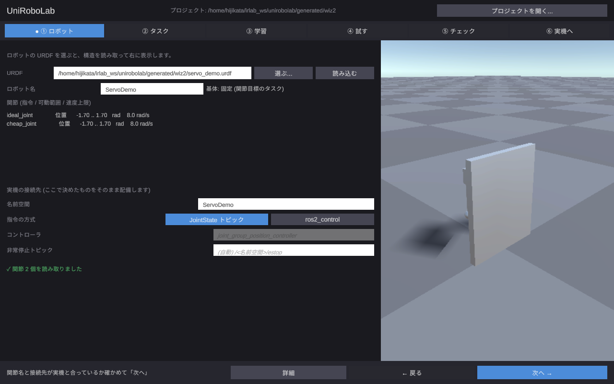
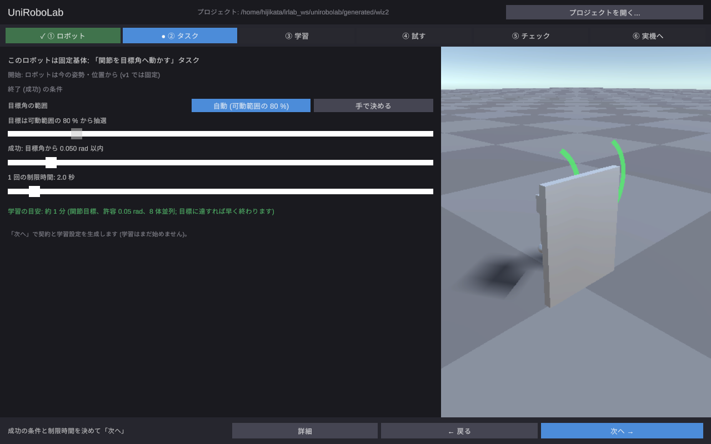
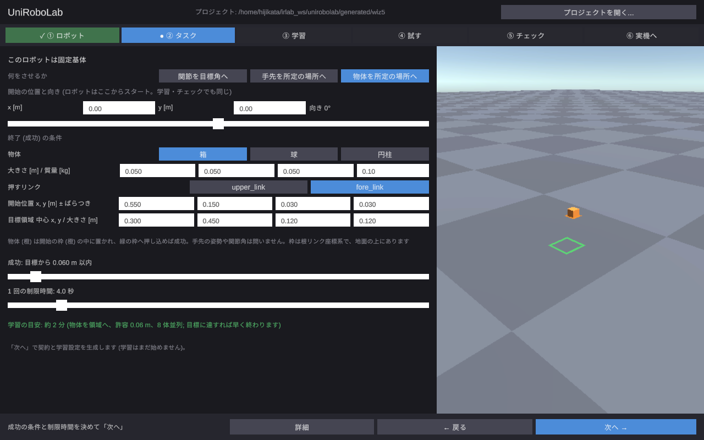
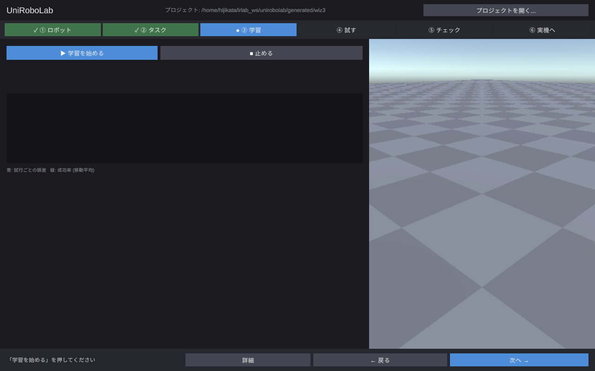
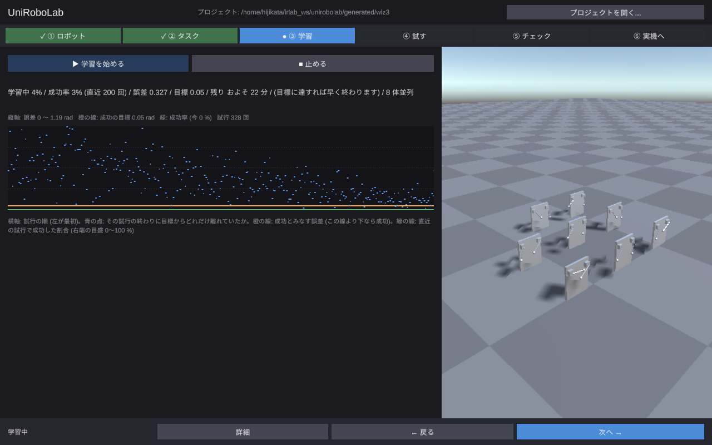
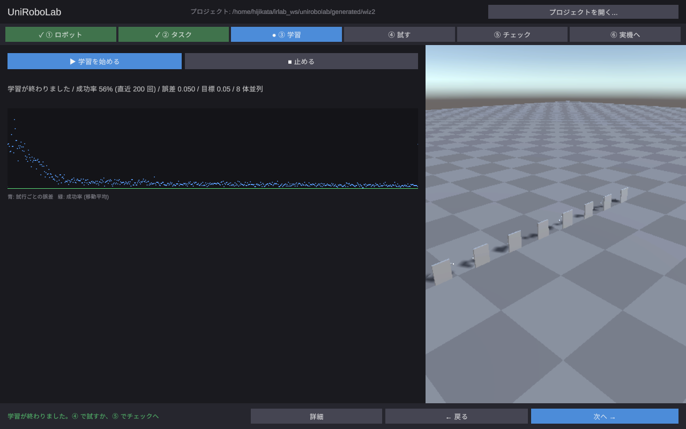
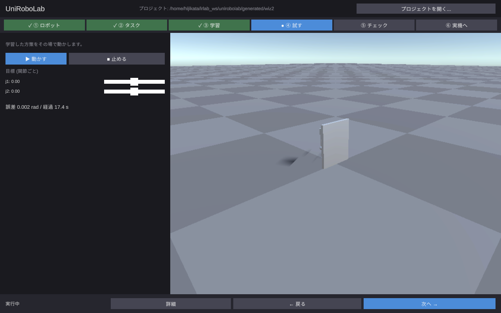
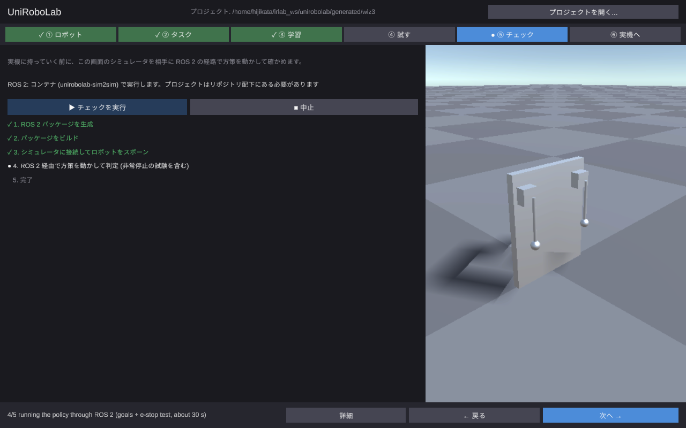
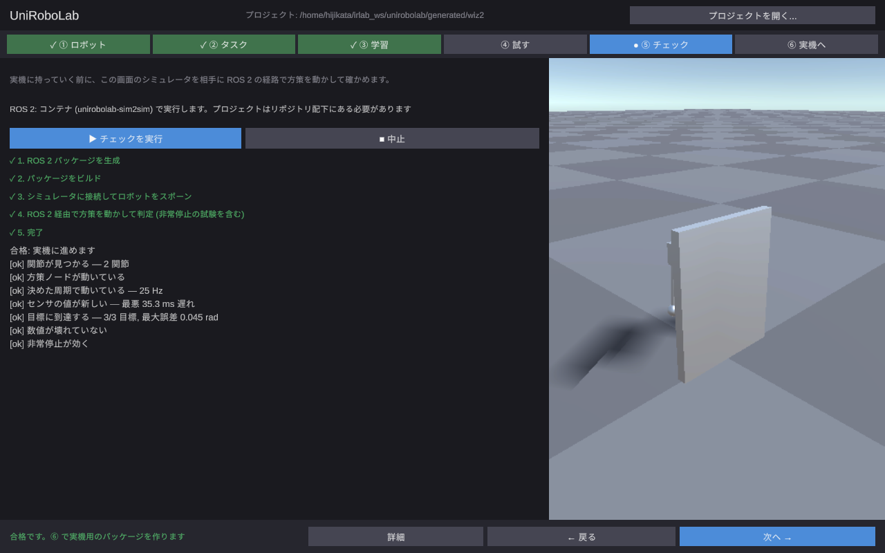
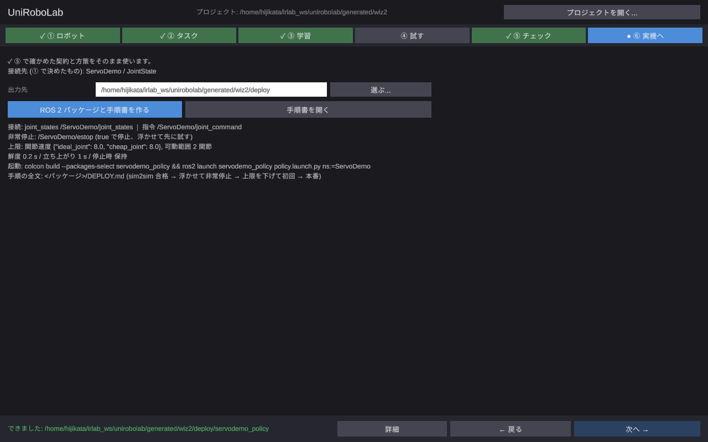

# チュートリアル: URDF から実機用パッケージまで (servo_demo)

UniRoboLab の画面だけで、ロボットの URDF から「学習 → 試す → 配備前チェック → 実機向けの ROS 2
パッケージ」まで通す手順です。題材は 2 関節のサーボ台 (servo_demo)。関節を目標角へ動かす方策を
学習します。所要時間はおよそ 20 分 (うち学習が 7〜8 分)。

画面は 2026-09-17 に実際に通したときのものです (v1 の GUI での旧版は docs/tutorial-v1-2026-09-16.md)。

## 0. 準備 (一度だけ)

- プレイヤーを作る: `scripts/build_player.sh` → `generated/player/UniRoboLab.x86_64`
- Python 環境を作る: `scripts/setup_python.sh --training` (`.venv` ができ、画面が自動で見つけます)
- 配備前チェック (⑤) には ROS 2 が要ります。この PC に無ければ同梱のコンテナを使います:
  `scripts/sim2sim_container.sh start` (⑤ の画面の「コンテナを起動」でも同じことができます)

起動:

```bash
scripts/unirobolab_gui.sh ~/unirobolab_projects/servo   # 引数はプロジェクトのフォルダ (無ければ作られる)
```

設定ファイルを書く必要はありません。学習用のサーバは既定で有効です。

画面は上から「ステッパー (① ロボット → ⑥ 実機へ)」「左: そのフェーズの主画面、右: 3D」「下: 状態行と
詳細 / 戻る / 次へ」です。ステッパーは今いる段階を青、済んだ段階を緑で示し、前提が無い段階は押せません。
やり直しが必要になった段階 (上流を変えたとき) には「!」が付きます。

## ① ロボット

「選ぶ...」で URDF を選びます。関節と可動範囲、指令の方式、基体の種類が読み取られて表に出て、
右にロボットが現れます。



下の「実機の接続先」は、⑥ で作るパッケージがそのまま使う値です。名前空間 (`/ServoDemo/joint_states`
の `ServoDemo`)、指令の方式 (JointState トピック / ros2_control)、非常停止トピック (空なら
`/<名前空間>/estop`)。ここで決めたものを ⑤ で確かめ、⑥ では変えません。

関節名と接続先が実機と合っていれば「次へ」。

## ② タスク

「どこから始めて、どうなれば成功か」を決めます。固定基体のロボットなので「関節を目標角へ動かす」
タスクが選ばれ、右の 3D に各関節の目標範囲が緑の弧で描かれます。

- 開始の位置と向き: x, y [m] と向き [°]。ここで決めた姿勢が ① のプレビュー、③ の学習、⑤ のチェックの
  すべてで使われます (既定は向き 180°: 正面がカメラを向く)



- 目標角の範囲: 自動 (可動範囲の 80 %) か、手で決める (スライダで ±rad)
- 成功とみなす誤差: 目標角から何 rad 以内か。ここでは 0.05 rad のまま
- 1 回の制限時間: 2 秒のまま
- 学習の目安: 許容誤差と並列数からの見込み。**許容誤差を半分にすると学習時間は数倍になります**

「次へ」で契約 (方策が何を見て何を出すかの定義) と学習設定が生成されます。契約 JSON を開く必要は
ありません (見たければ「詳細」)。

### 手先や物体を動かすタスク

固定基体では「何をさせるか」を切り替えられます。

- **手先を所定の場所へ**: 動かすリンクと、リンク上の点 (先端が既定)、目標の箱 (中心と大きさ、根リンク
  座標系 [m]) を決めます。3D には緑の箱と点 (緑の球) が出ます。目標は箱の中から抽選するので、
  届く範囲に置いてください。
- **物体を所定の場所へ**: 手先の姿勢や関節角は問わず、床の物体を緑の枠へ押し込めば成功です。
  物体 (箱・球・円柱、大きさ、質量)、押すリンク、物体の開始位置 (中心 ± ばらつき)、目標の枠
  (中心と大きさ) を決めます。3D には物体 (橙) と開始の枠 (橙)、目標の枠 (緑) が地面に描かれます。
  開始位置と目標の両方が押すリンクの届く範囲にあることを確かめてください。



物体のタスクでは ④ に「物体を開始位置へ戻す」ボタンと目標 (x, y) のスライダが出て、⑤ はシミュレータの
物体の位置を実機のカメラの代わりに使って判定します。実機では物体の位置を PoseStamped (ロボットの根
リンク座標系) で出すトピックが必要で、DEPLOY.md の接続表に行が増えます。

## ③ 学習



「学習を始める」を押すと、右に 8 体のロボットが 3×3 の格子に並んで学習が始まります (それぞれ別の
目標で同時に試行しています)。1 秒ごとに進捗が文で出ます。



「学習中 4% / 成功率 3% (直近 200 回) / 誤差 0.327 / 目標 0.05 / 残り およそ 22 分 / (目標に達すれば早く終わります) /
8 体並列」。残り時間は上限までの見込みで、目標の誤差に達すれば早く終わります。

グラフの読み方: 横軸は試行の順 (左が最初)。青の点は「その試行の終わりに目標からどれだけ離れていたか」で、
橙の線が「成功とみなす誤差」です。青の点がこの線より下に来る試行が増えると、緑の線 (直近の試行で成功した
割合、右端の目盛 0〜100 %) が上がります。学習が進むと青の点が橙の線の下に集まり、緑の線が上がっていきます。



この例では 7〜8 分で目標に達して止まりました (「学習が終わりました / 成功率 57% / 誤差 0.050 / 目標 0.05」)。
うまく行かないとき (成功率が 0 のまま、途中で悪化) は文の下に「次の一手」と「② に戻る」ボタンが出ます。

## ④ 試す (任意)

学習した方策をその場で動かします。「動かす」を押し、関節ごとのスライダで目標を変えると追従します。
状態は「誤差 0.002 rad / 経過 17 s」のように出ます。台車のロボットなら「地面をクリックして目標を置く」
で目標 (緑の円) を置け、走った軌跡が青い線で描かれます。



## ⑤ チェック (配備前)

実機に持っていく前に、この画面のシミュレータを相手に ROS 2 の経路で方策を動かして確かめます。
「チェックを実行」を押すと 5 段階が順に進みます (パッケージ生成 → ビルド → シミュレータに接続して
スポーン → ROS 2 経由で方策を動かして判定 → 完了)。1〜2 分かかります。



結果は平易なチェックリストです。非常停止の試験も含まれます。



NG があれば「次の一手」に何を直せばよいかが出ます (関節名の対応、行動の scale/offset、許容誤差、
シミュレータのフレームレート、など)。

ROS 2 が無い PC では、この画面の「コンテナを起動」で同梱のコンテナが立ち上がり、チェックはその中で
実行されます (プロジェクトのフォルダはリポジトリの配下にある必要があります)。

## ⑥ 実機へ

⑤ で確かめた契約と方策から ROS 2 パッケージと手順書 (DEPLOY.md) を作ります。接続先は ① で決めた
ものがそのまま使われます。



画面に要約 (接続するトピック、非常停止、上限値、起動コマンド) が出ます。「手順書を開く」で
DEPLOY.md の全文が開きます。実機では:

```bash
colcon build --packages-select servodemo_policy && source install/setup.bash
ros2 launch servodemo_policy policy.launch.py ns:=ServoDemo
```

DEPLOY.md の「動かす前に確かめること」(非常停止、可動範囲と速度の上限、観測の鮮度、立ち上がり時間)
を順に確認してから動かしてください。

## 途中でやめて後で続けるとき

もう一度同じ起動コマンドを実行すると、前回のプロジェクトが開き、成果物の有無から続きの段階に
戻ります。① のロボットや接続先、② のタスクを変えると、それより後の段階に「!」が付き、やり直しが
必要なことが分かります。

## 困ったとき

| 症状 | 見るところ |
|---|---|
| 「学習を始める」が押せない | 下の状態行に理由が出ます (Python 環境が無い、学習サーバが無効) |
| 「試す」で誤差が大きいまま | ③ の学習結果が古くないか (ステッパーの「!」)。詳細の実行器ログ |
| ⑤ が実行できない | ROS 2 もコンテナも無い。`scripts/sim2sim_container.sh start` か「コンテナを起動」 |
| 日本語が表示されない | OS に日本語フォント (Noto Sans CJK など) が無いと英語表示になります |

## この版で残っている課題

- ① は関節名を表で直せません (今は表示だけ)。実機の関節名と URDF が違うときは URDF 側を直してください。
- ② の開始条件は「今の姿勢・位置」に固定です (v1)。
- ⑤ をこの PC の ROS 2 で回すには、シミュレータ側のユーティリティ (simulation_ros2_utils、ros_tcp_endpoint)
  が必要です。コンテナには入っています。
